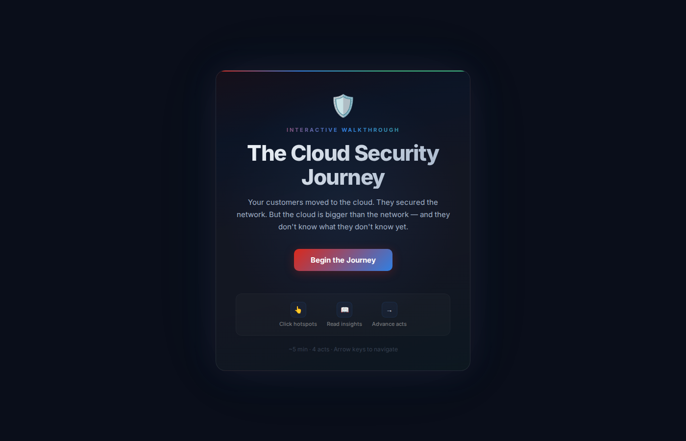

# The Cloud Security Journey — A Seller's Interactive Walkthrough

An interactive, single-file walkthrough that guides sellers through the cloud security posture conversation — from network-centric comfort to CSPM as the visibility layer.

## How to Use

### 1. Download the file

Click on **`cloud-journey-final.html`** in the file list above, then click the **download icon** (down arrow) in the top-right of the file view.

The download icon is the **down arrow** — the fourth icon in the toolbar shown above.

### 2. Open in your browser

Double-click the downloaded `cloud-journey-final.html` file. It will open in your default browser — no server, no install, no dependencies required.

### 3. Enter full screen

Press **F11** (Windows/Linux) or **Ctrl+Cmd+F** (Mac) to enter full-screen mode for the best experience.

### 4. Navigate the walkthrough

- Click **"Begin the Journey"** to start
- **Click numbered hotspots** on the diagram to open info panels with seller insights
- Use **"Next Act"** to advance through the four acts
- Use **arrow keys** (left/right) for quick navigation
- Press **Escape** to close panels

### 5. After the journey

The **summary card** distills the core sales message. From there, open **The Armory** for your seller's toolkit:

- **Cost of Inaction** — verified stats with source links
- **Discovery Questions** — organized by persona (CISO, Platform, SOC, GRC)
- **Objection Playbook** — honest "they say / you say" responses
- **Next Steps** — Cloud Crisis Room, Proof of Value, Executive Briefing

## Structure

This is a single self-contained HTML file — all CSS, JavaScript, and content are inline. No build step, no dependencies, no network connection required after download.

## The Four Acts

| Act | Title | Theme |
|-----|-------|-------|
| 1 | The Familiar | Lift-and-shift plus NGFW — the customer feels safe |
| 2 | The Blind Spot | Identities, storage, serverless — beyond the firewall |
| 3 | The Wake-Up Call | Privilege escalation and data exposure |
| 4 | The Path Forward | CSPM as the missing visibility layer |
